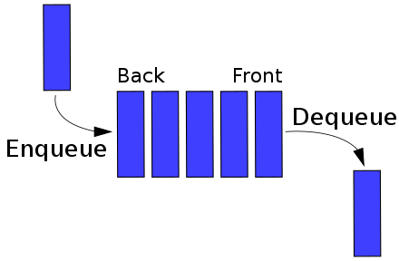

# Optimized Typescript queue

I was working on a javascript / _typescript_ challenge and noticed there is no inbuilt queue data structure.

So here is one to copy and paste for your projects.

Neatly documented to make learning easier.

## What is a queue?

#### A queue is a First-In-First-Out (FIFO) data structure where the first element added to the queue is the first one to be removed.

## How is it used?

```javascript
import * from "any/Queue.ts" // Import a queue that can accept all types.

new Queue([OPTIONAL ARGUMENTS]) // Create a new queue. With optional list of elements.
```

OR

```javascript
import * from "generic/Queue.ts" // Import a queue of defined type.

new Queue<Type>([OPTIONAL ARGUMENTS]) // Create a new queue of type Type. With optional list of elements.
```

THEN

```javascript
enqueue(element, [OPTIONAL ELEMENTS]); // Add a new element(s) to the end of the queue.

dequeue(); // Remove the element from the front of the queue and return it.

peek(); // Return the element from the front of the queue.

size || getSize(); // Return the queue size.
```

<picture>
  <source media="(prefers-color-scheme: dark)" srcset="readme/data_queue-light.png">
  <source media="(prefers-color-scheme: light)" srcset="readme/data_queue-dark.png">
  
</picture>

### Why not use the javascript / _typescript_ array.push(element) and [array.shift()](https://developer.mozilla.org/en-US/docs/Web/JavaScript/Reference/Global_Objects/Array/shift) methods?

That is a good question.

The default array.shift() method works the same as dequeue(),

However every array.shift() call rebuilds the array and has an O(n) complexity, leading to slow performance for large queues.

Here dequeue() is an O(1) operation up to a given limit, which you can edit.
